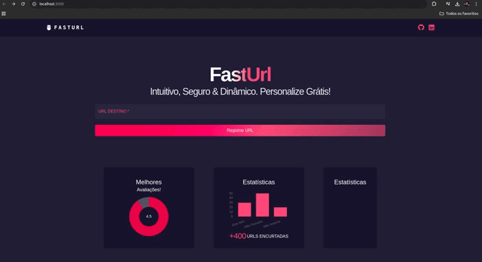

# Url-Shortener | Encurtador de URL



URL Shortener é um encurtador de URLs moderno e eficiente desenvolvido em Next.js (utilizando React para o frontend e Node.js para o backend). O projeto segue as melhores práticas de programação, garantindo um código limpo, seguro e fácil de manter. Conta com uma suíte completa de testes automatizados para assegurar a qualidade do software e um pipeline CI/CD que facilita o processo de integração e entrega contínua, garantindo que cada nova funcionalidade seja implementada com segurança e sem impactar a performance e a estabilidade do sistema.

## Instalação sem docker

Certifique-se de ter o Node instalado na sua máquina.

1. Clone este repositório:

    ```
    git clone https://github.com/danieldevpy/Url-Shortener
    ```

2. Instale as dependências:

    ```
    npm install
    ```

3. Execute 
    ```
    npm run dev
    ```

## Instalação com docker

Certifique-se de ter o docker e docker-compose em sua máquina.

1. Clone este repositório:

    ```
    git clone https://github.com/danieldevpy/Url-Shortener
    ```

2. Execute:

    ```
    docker-compose up --build
    ```

## Contribuição

Contribuições são bem-vindas! Sinta-se à vontade para abrir issues ou pull requests.

## Licença

Este projeto está licenciado sob a [Licença MIT](LICENSE).
